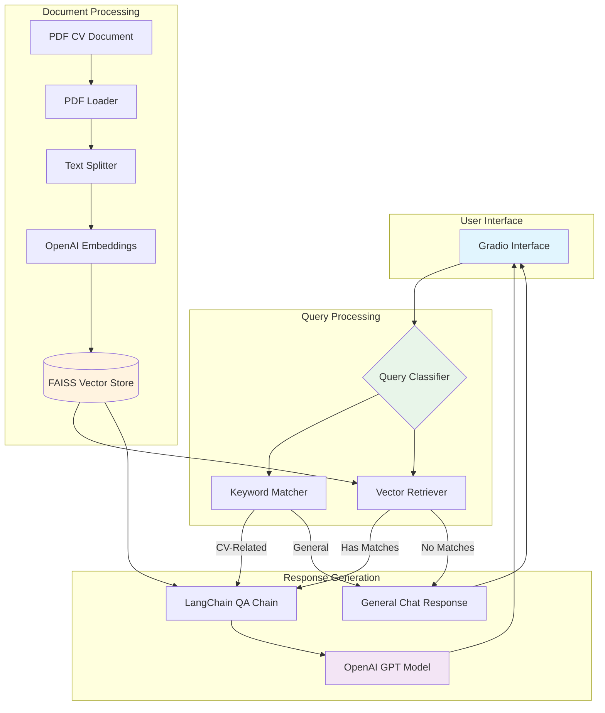
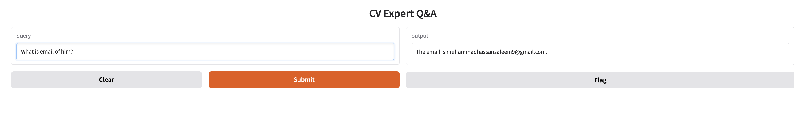

# CV Reader Expert (RAG)

## Overview

**CV Reader Expert** is a **Retrieval-Augmented Generation (RAG)** system designed to extract detailed information from CVs (resumes) stored in **PDF format**. This system can answer questions about the **skills**, **experience**, **education**, and **certifications** of individuals based on their CVs.

### Key Features:
* **Document Ingestion**: Upload CVs in PDF format
* **Smart Query Classification**: Automatically classifies whether the question is related to the CV (skills, experience, education) or a general chat query
* **RAG Pipeline**: Combines document retrieval with OpenAI's language model to generate accurate responses based on CV content
* **Gradio Interface**: User-friendly interface for interacting with the system

---

## Architecture

The system architecture consists of the following key components:

1. **Document Ingestion and Preprocessing**:
   * **PDF loader**: Loads and splits the CV document into chunks for easier processing
   * **Vector Store**: Embeds document chunks using OpenAI embeddings and stores them in a **FAISS** vector store

2. **Smart Query Classification**:
   * The query is first passed through the **classifier node**. It classifies whether the question is about the CV (document-related) or a general query (general chat)
   * The classifier uses both **keyword matching** (for CV-related terms like "experience", "skills") and **retriever-based classification** (using the vector store)

3. **Retrieval-Augmented Generation (RAG)**:
   * If the query is document-related, the **retriever** fetches relevant chunks from the vector store
   * The **QA Chain** (using **LangChain**) processes the retrieved chunks and generates an accurate answer
   * If the query is a general chat question, a fallback response is provided

4. **Gradio Interface**:
   * A simple user interface where the user can input their question (e.g., "What is Hassan's experience?")
   * The interface displays the response generated by the model

---

## Architecture Diagram



### Data Flow Description

1. **Document Ingestion Phase**:
   - CV PDF → PDF Loader → Text Splitter → OpenAI Embeddings → FAISS Vector Store

2. **Query Processing Phase**:
   - User Query → Query Classifier → Route Decision (CV-related or General)

3. **Retrieval Phase**:
   - CV-related Query → Vector Retriever → Fetch Relevant Chunks from FAISS

4. **Generation Phase**:
   - Retrieved Chunks + Query → LangChain QA Chain → OpenAI GPT → Response

---

## How It Works

1. **User Interaction**: The user types a query into the Gradio interface
2. **Classifier Node**: The system determines whether the query is about the CV or is a general question
3. **Document Answer**: If the query is document-related, the retriever fetches relevant document chunks, and the QA chain generates an answer
4. **Response**: The answer is displayed to the user in the interface



---

## Setup and Installation

### Prerequisites

* Python 3.8 or higher
* Virtual environment (optional but recommended)

### Installation Steps

1. Clone the repository:
   ```bash
   git clone https://github.com/your-repo/cv-reader-expert.git
   cd cv-reader-expert
   ```

2. Create and activate a virtual environment (optional):
   ```bash
   python -m venv .venv
   source .venv/bin/activate   # On Windows, use .venv\Scripts\activate
   ```

3. Install required dependencies:
   ```bash
   pip install -r requirements.txt
   ```

4. Add your **OpenAI API Key** in the `.env` file:
   ```env
   OPENAI_API_KEY=your-openai-api-key
   ```

5. Run the application:
   ```bash
   python app.py
   ```

6. Open the local server URL in your browser (default: [http://127.0.0.1:7860](http://127.0.0.1:7860))

---

## Dependencies

Key libraries used in this project:

- **langchain**: Framework for building LLM applications
- **openai**: OpenAI API client for embeddings and GPT models
- **faiss-cpu**: Facebook AI Similarity Search for vector storage
- **PyPDF2**: PDF processing and text extraction
- **gradio**: Web interface framework
- **python-dotenv**: Environment variable management

---

## Usage Example

```python
# Sample query examples
questions = [
    "What is Hassan's educational background?",
    "List all programming languages mentioned in the CV",
    "What certifications does the candidate have?",
    "Summarize the work experience",
    "What are the key skills?"
]
```

---

## Contributing

1. Fork the repository
2. Create a new branch (`git checkout -b feature/your-feature`)
3. Commit your changes (`git commit -am 'Add new feature'`)
4. Push to your branch (`git push origin feature/your-feature`)
5. Create a pull request

---

## License

This project is licensed under the MIT License - see the [LICENSE](LICENSE) file for details.